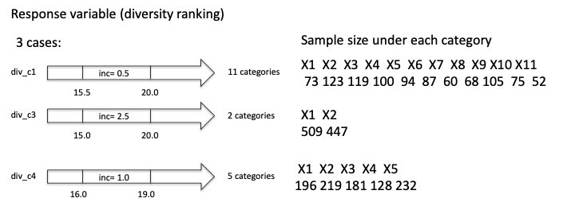
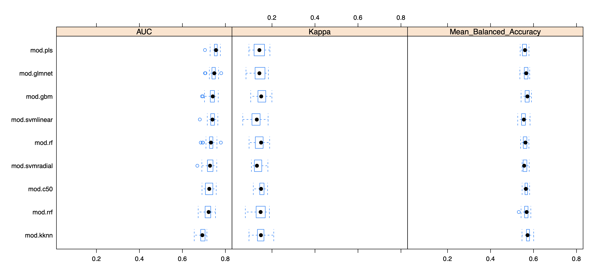
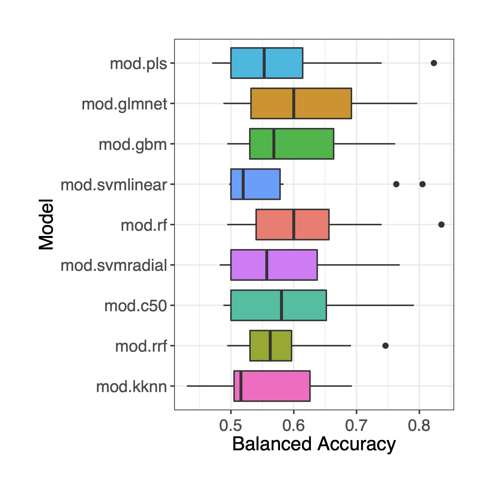

## nonpareil/machine_learning
Schemes: convert Nonpareil diversity (Nd) from a numerical variable to a nominal variable

### Algorithms examined
|Method name in caret package|Model name                                                 |
|----------------------------|-----------------------------------------------------------|
|rf                          |random forest                                              |
|glmnet                      |Lasso and Elastic-Net Regularized Generalized Linear Models|
|RRFglobal                   |regularized random forest                                  |
|gbm                         |Stochastic Gradient Boosting                               |
|C5.0Tree                    |Single C5.0 Tree                                           |
|svmLinear                   |Support Vector Machines with Linear Kernel                 |
|svmRadial                   |Support Vector Machines with Radial Basis Function Kernel  |
|pls                         |partial least squares                                      |
|kknn                        |k nearest neighbors                                        |

### Select the best algorithm (use div_c1 as an example)

